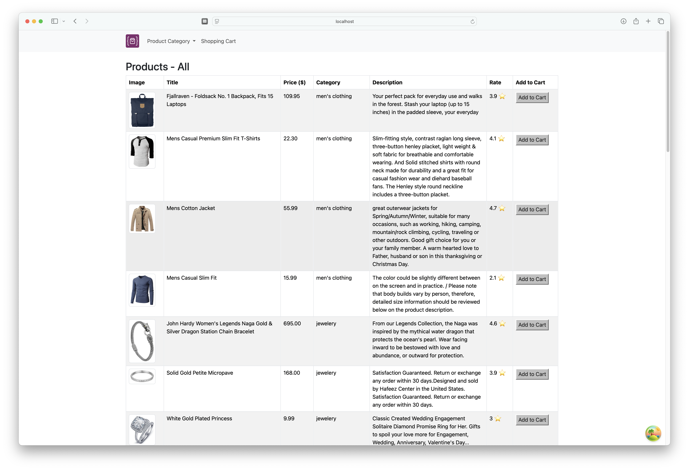
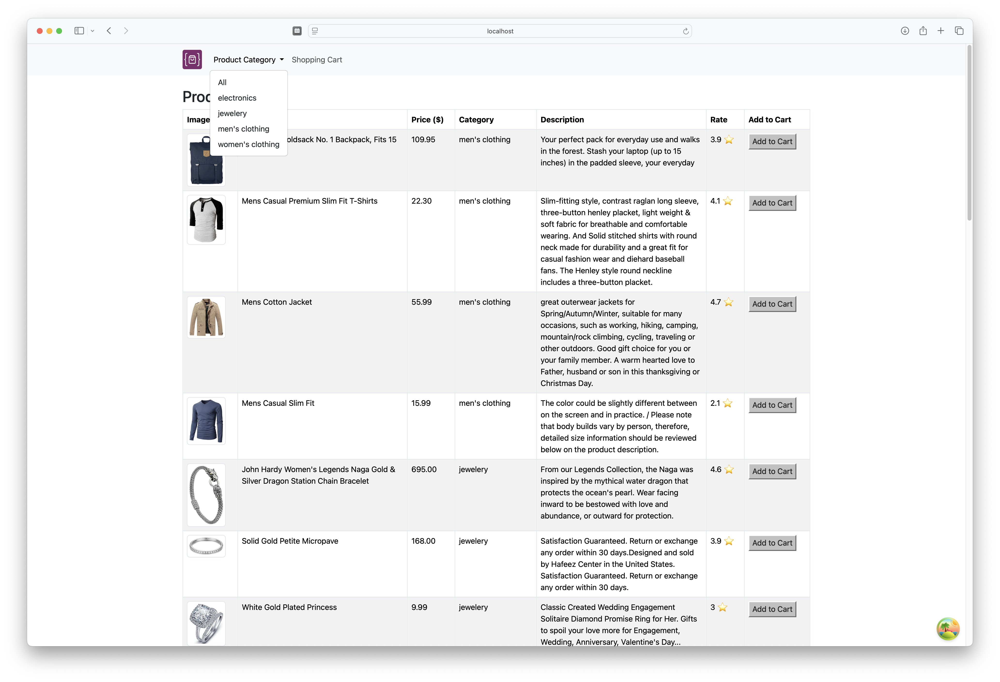
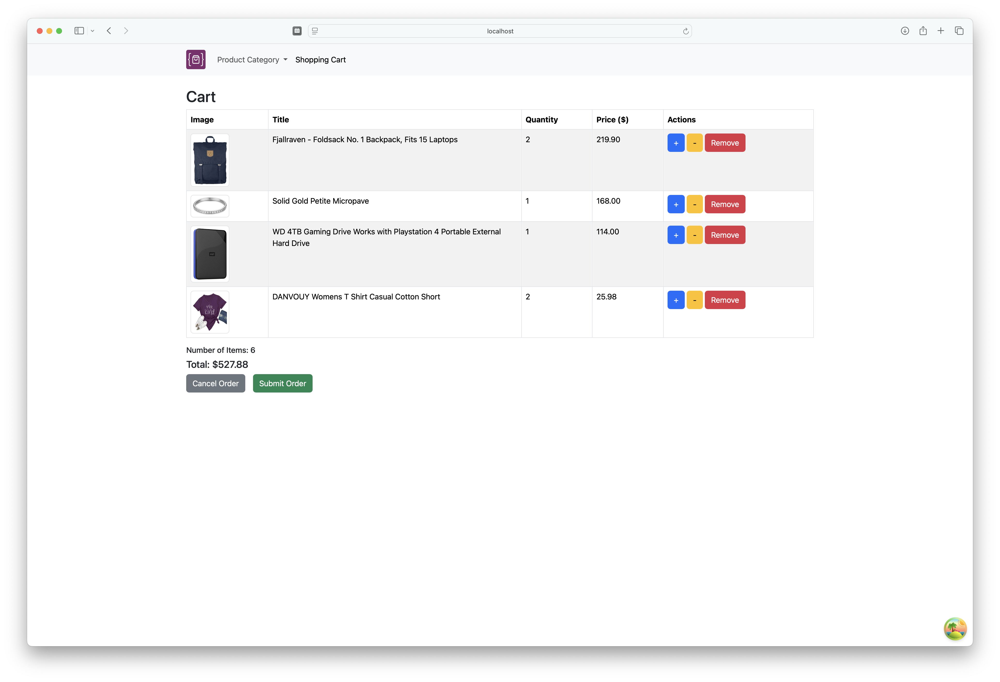
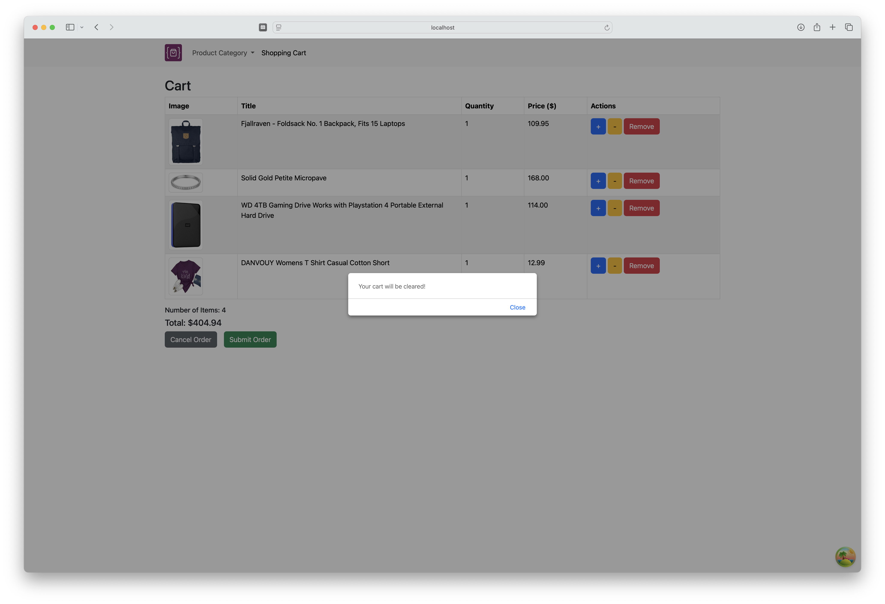

# Advanced React E-Commerce Web App

The Advanced React E-Commerce Web App is a responsive and dynamic React E-Commerce web application featuring global state management with Redux Toolkit, server state handling with React Query, and styled with Bootstrap. Products are fetched from the [Fake Store API](https://fakestoreapi.com/).


## Installation

1. Clone this repository: 
```bash
git clone https://github.com/jessicaanne0982/FE_Mod1_Advanced_React_Ecommerce_App
```
2. Within the terminal, navigate to the advanced-react-ecommerce-app directory: 
```bash
cd advanced-react-ecommerce-app
```
3. Install the required dependency:
```bash
npm install
```
This installs all packages listed in the package.json, including, Redux, React Query, Bootstrap, as well as others.

4. Run the application in development mode: 
```bash
npm run dev
```

5. Open [http://localhost:5173/](http://localhost:5173/) to view the application in the browser.

## Usage
### Home Page


The Home Page a list of the products available.

---
### Product Categories

Use the navigation to filter products by category.  These categories are pulled dynamically from the API.

---
### Shopping Cart

The Shopping Cart displays selected items, total cost, and lets users edit quantities, remove items, cancel, or place the order.


---
### Order Actions
 

 

Users can cancel the order, clearing the cart, or choose to submit the order to complete their shopping experience.

## Tech Stack
- React
- Redux Toolkit
- React Query
- Bootstrap
- Vite
- Fake Store API

## GitHub Link

[Advanced React E-Commerce Web App](https://github.com/jessicaanne0982/FE_Mod1_Advanced_React_Ecommerce_App)

