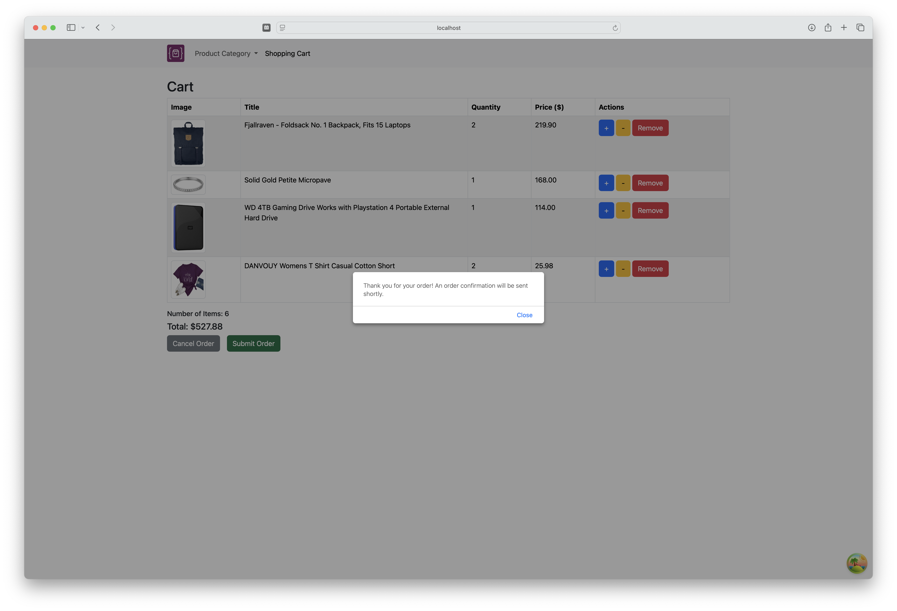
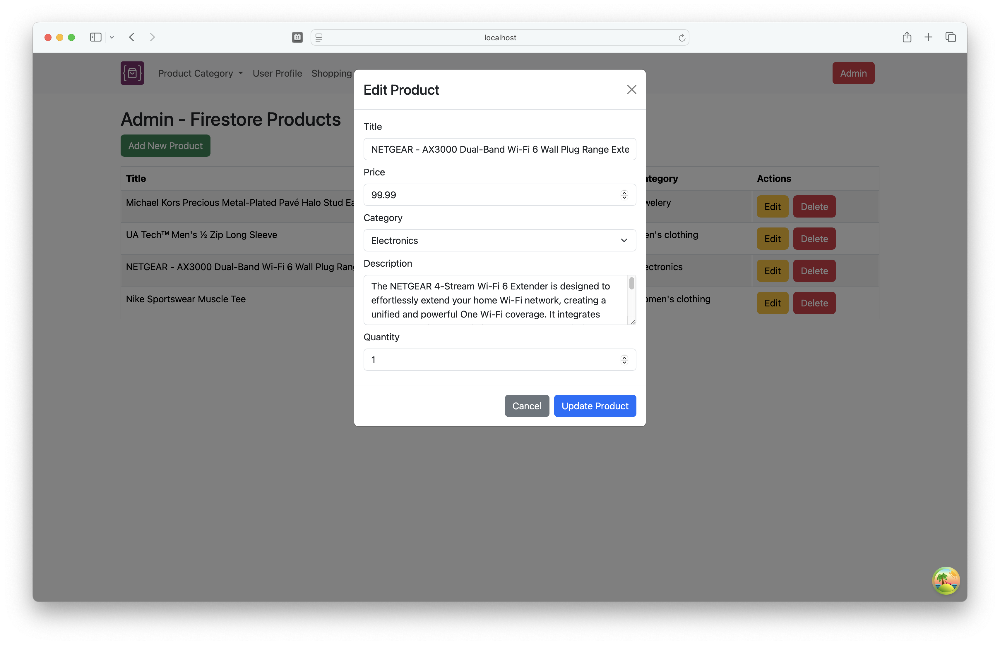

# Advanced React E-Commerce Web App


A responsive and dynamic e-commerce web application built with React, featuring global state management via Redux Toolkit, server state handling with React Query, and styled using Bootstrap. Product data is fetched in real-time from the [Fake Store API](https://fakestoreapi.com/), while Firebase Authentication secures user login and registration, and Firestore is used for storing user profiles, admin-managed products, and submitted orders.

## Features
- Browse real-time products from the Fake Store API
- Filter products by category (dynamically loaded)
- Add, edit, and remove items from the shopping cart
- Full CRUD support for Firestore-based admin products
- User authentication with Firebase
- Persistent global state via Redux
- Protected routes for authenticated users
- Admin panel for product management

## Tech Stack
- React (with TypeScript)
- Redux Toolkit - for global state management
- React Query - for server-side data fetching and caching
- Bootstrap - for responsive UI components
- Vite - for fast development build process
- Firebase - for authentication and Firestore database
- Fake Store API - for mock product data

## Installation

1. Clone this repository: 
```bash
git clone https://github.com/jessicaanne0982/FE_Mod1_Advanced_React_Ecommerce_App
```
2. Within the terminal, navigate to the advanced-react-ecommerce-app directory: 
```bash
cd advanced-react-ecommerce-app
```
3. Install the required dependency:
```bash
npm install
```
This installs all packages listed in the package.json, including, Redux, React Query, Bootstrap, as well as others.

4. Start the development server: 
```bash
npm run dev
```

5. Open [http://localhost:5173/](http://localhost:5173/) to view the application in the browser.

## Usage
### Home Page


The Home Page displays a list of products available from both the Fake Store API and Firestore.

---
### Product Categories

Use the navigation to filter products by category.  These categories are pulled dynamically from the API.

---
### Shopping Cart

The Shopping Cart displays selected items, total cost, and lets users edit quantities, remove items, cancel, or place the order.


---
### Order Actions
 

 

Users can cancel the order, clearing the cart, or choose to submit the order to complete their shopping experience.

---
### User Authentication


New functionality includes user registration, login, and account management features. Users can now view their order history, with each order offering a "View Details" button that opens a modal displaying complete order information. Additionally, users have the option to delete their accounts.

--- 
### Admin Panel


Add new products, update existing ones via modal forms, or delete products directly from the Firestore-backed database.

## CI/CD Setup
This project uses Continuous Integration (CI) and Continuous Deployment (CD) for streamlined development and deployment.

### Continuous Integration (CI)
Automated tests are run using:
- Jest
- React Testing Library

Run tests locally:
```bash
npm test
```
---
### Continuous Deployment (CD)
The app is automatically deployed via Vercel.

Live deployment: [https://fe-ecommerce-app-gamma.vercel.app](https://fe-ecommerce-app-gamma.vercel.app)

## GitHub Link

[Advanced React E-Commerce Web App](https://github.com/jessicaanne0982/FE_Mod1_Advanced_React_Ecommerce_App)

